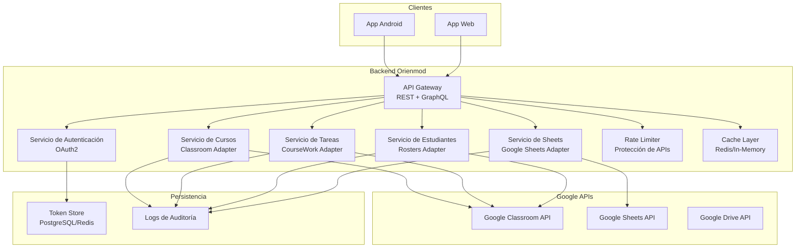

# 🚀 Orienmod Backend

> Middleware educativo de alto rendimiento desarrollado en Go (Golang) bajo **Arquitectura Hexagonal (Ports & Adapters)**. Actúa como capa de orquestación desacoplada entre clientes móviles/web y las APIs oficiales de Google (Classroom, Sheets, Drive).

---

## 📌 Tabla de Contenidos
- [Visión General](#-visión-general)
- [Hoja de Ruta del Proyecto](#-hoja-de-ruta-del-proyecto)
- [Arquitectura del Sistema](#-arquitectura-del-sistema)
- [Estructura del Proyecto](#-estructura-del-proyecto)
- [Componentes Clave y Tecnologías](#-componentes-clave-y-tecnologías)
- [Endpoints Principales (REST & GraphQL)](#-endpoints-principales-rest--graphql)
  - [Endpoints REST](#endpoints-rest)
  - [Esquema GraphQL](#esquema-graphql)
- [Configuración de Variables de Entorno](#-configuración-de-variables-de-entorno)
- [Requisitos Previos e Instalación](#-requisitos-previos-e-instalación)
- [Ejecución y Despliegue](#-ejecución-y-despliegue)
- [Estrategia de Pruebas](#-estrategia-de-pruebas)
- [Consideraciones de Seguridad](#-consideraciones-de-seguridad)
- [Licencia](#-licencia)

---

## 🌐 Visión General

Orienmod centraliza la lógica de negocio de gestión educativa digital, abstrayendo la complejidad de autenticación, cuotas y límites de las APIs de Google mediante un diseño modular y fácilmente testeable.

### Características Clave:
* **Autenticación OAuth2:** Flujo seguro de tres patas con almacenamiento persistente de tokens.
* **Resiliencia & Rate Limiting:** Control estricto de cuotas por usuario e IP para evitar bloqueos por parte de servicios de terceros.
* **Interfaz Dual de API:** Disponibilidad simultánea de REST para endpoints convencionales y GraphQL para consultas complejas.
* **Arquitectura Hexagonal:** Desacoplamiento total entre dominio de negocio, fuentes de datos y protocolos de transporte.

---

## 🗺️ Hoja de Ruta del Proyecto

El desarrollo del proyecto sigue una secuencia modular estrictamente priorizada:

- [x] **Paso 1: Creación del Modelo Base** — Definición del dominio, puertos y adaptadores principales en Go.
- [x] **Paso 2: Integración de Herramientas** — Conectores a Google Classroom, Sheets y Drive.
- [x] **Paso 3: Creación de la API** — Conexión formal y exposición de datos vía REST y GraphQL.
- [ ] **Paso 4: Aplicación Móvil** — Desarrollo de la app cliente para Android.

---

## 🏗️ Arquitectura del Sistema


## 🏗️ estructura del proyecto

```
orienmod-backend/
├── cmd/
│   └── api/
│       └── main.go                     # Punto de entrada principal
├── internal/
│   ├── adapters/
│   │   ├── input/                      # Adaptadores de entrada
│   │   │   ├── http/
│   │   │   │   ├── router/             # Router REST/GraphQL
│   │   │   │   │   └── router.go
│   │   │   │   └── handlers/           # Handlers HTTP REST
│   │   │   │       ├── auth.go
│   │   │   │       ├── courses.go
│   │   │   │       ├── tasks.go
│   │   │   │       └── students.go
│   │   │   └── graphql/                # Servidor y esquemas GraphQL
│   │   │       ├── resolver.go
│   │   │       └── schema.graphqls
│   │   └── output/                     # Adaptadores de salida
│   │       ├── google/
│   │       │   ├── adapter.go          # Cliente Google Classroom
│   │       │   ├── sheets.go           # Cliente Google Sheets
│   │       │   └── limiter.go          # Rate limiting
│   │       └── storage/
│   │           ├── memory.go           # TokenStore en memoria
│   │           └── postgres.go         # TokenStore en PostgreSQL
│   ├── core/                           # Núcleo de la aplicación
│   │   ├── domain/                     # Entidades de negocio
│   │   │   ├── course.go
│   │   │   ├── student.go
│   │   │   ├── task.go
│   │   │   ├── grade.go
│   │   │   └── event.go
│   │   └── ports/                      # Interfaces (Contratos)
│   │       ├── input/                  # Puertos de entrada
│   │       │   ├── auth_service.go
│   │       │   ├── course_service.go
│   │       │   └── task_service.go
│   │       └── output/                 # Puertos de salida
│   │           ├── token_repository.go
│   │           ├── course_repository.go
│   │           └── sheets_repository.go
│   └── shared/                         # Código compartido
│       ├── config/                     # Carga de variables y configuración
│       ├── errors/                     # Manejo centralizado de errores
│       ├── logger/                     # Logging estructurado
│       └── validation/                 # Validaciones de datos
├── pkg/                                # Utilitarios reutilizables
│   └── utils/
├── deployments/                        # Configuraciones de contenedor
│   └── docker/
│       ├── Dockerfile
│       └── docker-compose.yml
├── go.mod
├── go.sum
└── .env
```

### 🛠️ Componentes Clave y Tecnologías

| Componente | Tecnología | Versión | Propósito |
| :--- | :--- | :--- | :--- |
| **Lenguaje** | Go (Golang) | 1.21+ | Lenguaje principal del backend |
| **API** | GraphQL + REST | - | Capa de exposición a clientes |
| **GraphQL** | gqlgen | v0.17.94 | Generación automatizada de código GraphQL |
| **HTTP Router** | Gorilla Mux | v1.8.0 | Enrutador HTTP para la API REST |
| **OAuth2** | golang.org/x/oauth2 | v0.36.0 | Integración y autenticación con Google |
| **Google APIs** | google.golang.org/api | v0.288.0 | Clientes de Classroom, Sheets y Drive |
| **Rate Limiting** | golang.org/x/time | v0.15.0 | Limitador de tasa por ventana deslizante |
| **Base de datos** | PostgreSQL (opcional) | - | Persistencia de tokens y auditoría |
| **Cache** | Redis (opcional) | - | Caché temporal de datos e hilos |
| **Logging** | Zerolog | v1.33.0 | Logs estructurados en formato JSON |
| **Testing** | Go testing + testify | - | Suite de pruebas unitarias e integración |
| **Container** | Docker | - | Contenerización y despliegue |

### 🔌 Endpoints REST

| Método | Endpoint | Descripción | Autenticación |
| :--- | :--- | :--- | :---: |
| GET | `/health` | Chequeo de estado del servicio | ❌ No |
| GET | `/api/v1/auth/google` | Iniciar flujo OAuth2 con Google | ❌ No |
| GET | `/api/v1/auth/google/callback` | Receiver del código de autorización OAuth2 | ❌ No |
| POST | `/api/v1/auth/logout` | Revocar sesión activa | ✅ Sí |
| GET | `/api/v1/courses` | Listar cursos del usuario | ✅ Sí |
| POST | `/api/v1/courses` | Crear un nuevo curso | ✅ Sí |
| GET | `/api/v1/courses/{id}` | Obtener detalle de un curso | ✅ Sí |
| PUT | `/api/v1/courses/{id}` | Actualizar parámetros de un curso | ✅ Sí |
| DELETE | `/api/v1/courses/{id}` | Eliminar curso | ✅ Sí |
| GET | `/api/v1/courses/{id}/students` | Listar estudiantes inscritos | ✅ Sí |
| POST | `/api/v1/courses/{id}/students` | Inscribir estudiante | ✅ Sí |
| DELETE | `/api/v1/courses/{id}/students/{studentId}` | Remover estudiante del curso | ✅ Sí |
| POST | `/api/v1/courses/{id}/sync` | Sincronizar datos con Google Classroom | ✅ Sí |
| GET | `/api/v1/tasks?course_id=xxx` | Listar tareas por curso | ✅ Sí |
| POST | `/api/v1/tasks` | Crear nueva tarea | ✅ Sí |
| GET | `/api/v1/tasks/{id}` | Consultar detalle de tarea | ✅ Sí |
| PUT | `/api/v1/tasks/{id}` | Editar información de tarea | ✅ Sí |
| DELETE | `/api/v1/tasks/{id}` | Eliminar tarea | ✅ Sí |
| GET | `/api/v1/tasks/{id}/submissions` | Consultar entregas recibidas | ✅ Sí |
| POST | `/api/v1/tasks/{id}/grade` | Asignar calificación a entrega | ✅ Sí |
| POST | `/query` | Endpoint único para GraphQL | ✅ Sí |
| GET | `/graphql` | Interfaz Playground GraphQL | ❌ No |

```
# Consultas
type Query {
    checkAuth(email: String!): AuthCheckResponse!
    courses(email: String!): [Course!]!
    course(id: String!, email: String!): Course!
    searchCourses(query: String!, email: String!): [Course!]!
    students(courseId: String!, email: String!): [Student!]!
    searchStudents(courseId: String!, query: String!, email: String!): [Student!]!
    tasks(courseId: String!, email: String!): [Task!]!
    task(id: String!, courseId: String!, email: String!): Task!
    taskSubmissions(taskId: String!, courseId: String!, email: String!): [TaskSubmission!]!
}

# Mutaciones
type Mutation {
    authLogin(input: AuthLoginInput!): String!
    authCallback(input: AuthCallbackInput!, email: String!): AuthResponse!
    authLogout(input: AuthLogoutInput!, email: String!): AuthResponse!
    authRefresh(input: AuthRefreshInput!, email: String!): AuthResponse!
    createCourse(input: CreateCourseInput!, email: String!): Course!
    updateCourse(input: UpdateCourseInput!, email: String!): Course!
    deleteCourse(id: String!, email: String!): Boolean!
    syncCourse(id: String!, email: String!): Int!
    addStudent(input: AddStudentInput!, email: String!): Student!
    deleteStudent(courseId: String!, studentId: String!, email: String!): Boolean!
    createTask(input: CreateTaskInput!, email: String!): Task!
    updateTask(input: UpdateTaskInput!, email: String!): Task!
    deleteTask(id: String!, courseId: String!, email: String!): Boolean!
    gradeTask(input: GradeTaskInput!, email: String!): Boolean!
}
```